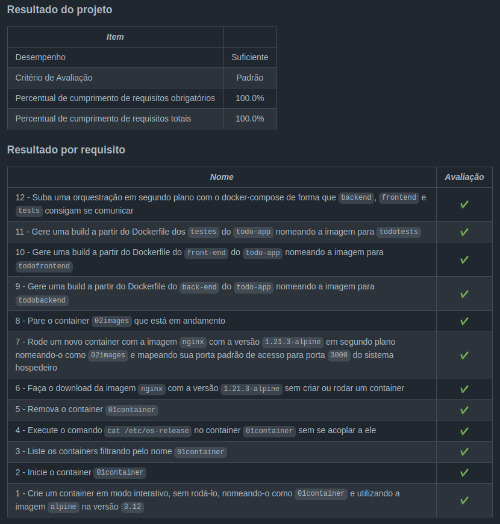

<h1>Sobre</h1>

Primeiro projeto do módulo 3 - Back-end, da <a href="https://betrybe.com" target="_blank">Trybe!</a>

O desafio foi executar linhas de comando próprios do docker, criar imagens e contêineres e orquestrar o funcionamento deles com o Docker Compose. 

obs: O todo-app foi disponibilizado pela Trybe.

<h1>Tecnologias utilizadas</h1>

<ul>
  <li>Docker</li>
  <li>Docker-compose</li>
</ul>

<h1>Nota</h1>

